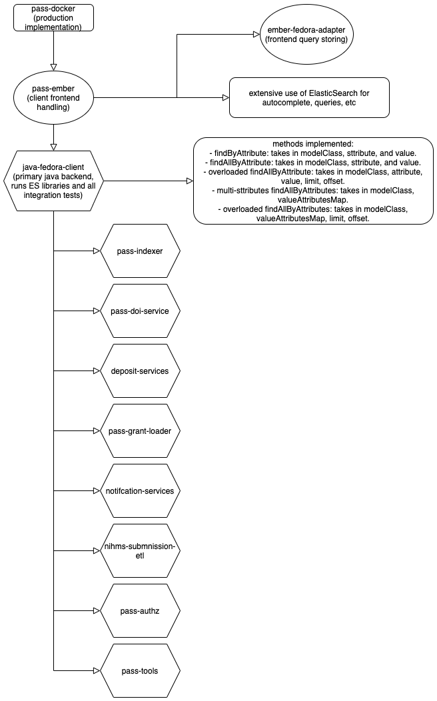

# architecture.md

The following modules deal with the ElasticSearch implementation across the OA-Pass repository.

                                                   
1. pass-docker (entrypoint)
2. pass-ember (frontend)
3. ember-fedora-adapter (frontend query storing)
4. java-fedora-client (java backend)
4. pass-indexer (indexing service on the backend)
5. pass-doi-service (for searching through DOI records)
6. deposit-services (runs several searches on teh backend)
7. pass-grant-loader (loading services for grants)
8. notification-services (used for passing notification information from backend to frontend)
9. nihms-submission-etl (NIHMS submission helper)
10. pass-authz (integration tests helper)
11. pass-tools (internal tools)
12. jhu-package-providers (assets providers)
13. data-model-migration (internal)

## java-fedora-client
* implements the java libraries for managing elastic search queries on the backend. *

1. Pass Data Client
*Creates instances of objects needed to perform PassClient requirements, and redirects to appropriate service (Index client or CRUD client).*

methods implemented:
- findByAttribute: takes in modelClass, sttribute, and value.
- findAllByAttribute: takes in modelClass, sttribute, and value.
- overloaded findAllByAttribute: takes in modelClass, attribute, value, limit, offset.
- multi-sttributes findAllByAttributes: takes in modelClass, valueAttributesMap.
- overloaded findAllByAttributes: takes in modelClass, valueAttributesMap, limit, offset.

Retrieve Search Results from ElasticSearch: getIndexerResults(String querystring, int limit, int offset)
Search the index using querystring: {}, with limit {} and offset {}", querystring,  limit, offset)

2. PASS Client API
* Takes any PassEntity and persists it in the database, returns the URI if successful or appropriate exception if not. Note that PassEntities that are being created should have null as their ID, the URI will the the ID field when reading the resource back. *
* Takes modelObj The entity to be created *
* returns URI of new record *

Implements the following ES methods:
- createResource(PassEntity modelObj)
- createAndReadResource(T modelObj, Class<T> modelClass)
- updateResource(PassEntity modelObj)
- updateAndReadResource(T modelObj, Class<T> modelClass)
- deleteResource(URI uri)
- readResource(URI uri, Class<T> modelClass)

- findByAttribute(Class<T> modelClass, String attribute, Object value)
- findAllByAttribute(Class<T> modelClass, String attribute, Object value)
- findAllByAttribute(Class<T> modelClass, String attribute, Object value, int limit, int offset)
- findAllByAttribute(Class<T> modelClass, String attribute, Object value, int limit, int offset)
- findAllByAttributes(Class<T> modelClass, Map<String, Object> attributeValuesMap, int limit, int offset)
- getIncoming(URI passEntity)
- upload(URI entityUri, InputStream content)
- upload(URI entityUri, InputStream content, Map<String, ?> params)
- processAllEntities(Consumer<URI> processor, Class<T> modelClass)
